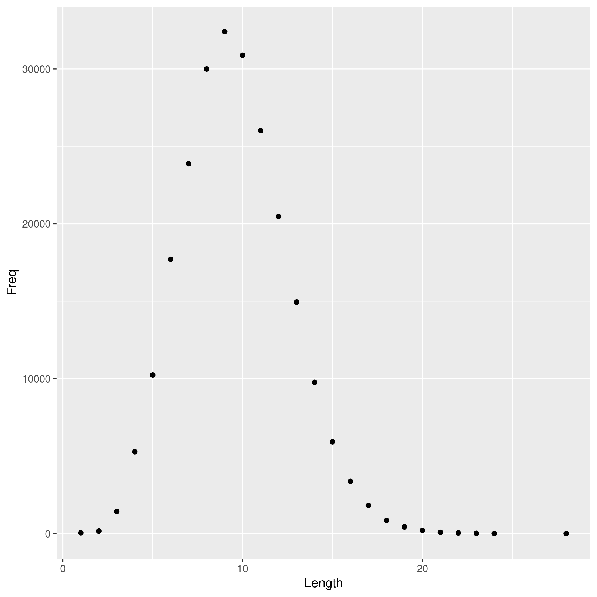

```{r setup, include=FALSE}
knitr::opts_chunk$set(echo = TRUE)
```

## Word Length Histogram Report

#### R Automation Pipeline Tutorial

<https://stat545.com/automating-pipeline.html>

```{r read_table}
counts <- read.delim("histogram.tsv")
```

```{r most_common}
most.freq.len <- counts$Length[which.max(counts$Freq)]
```

The most common English word length is `r most.freq.len`.

